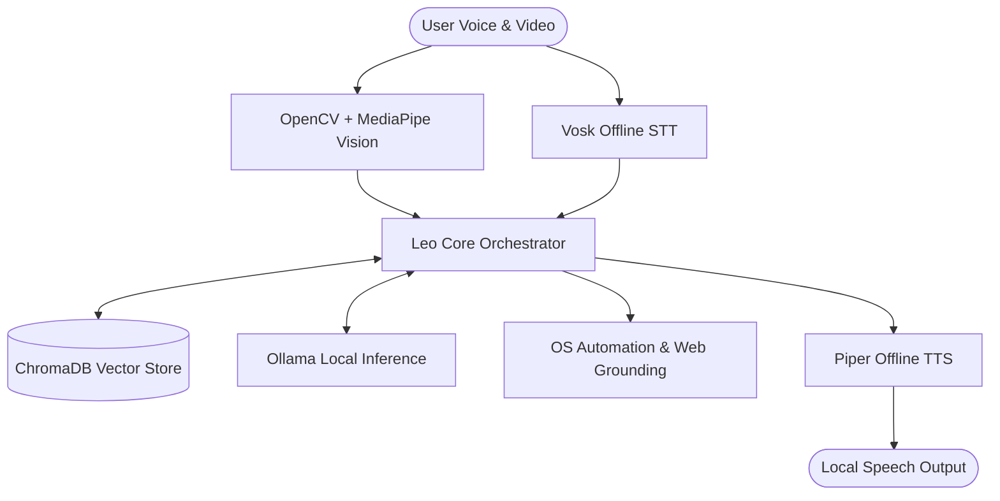

# 🤖 Frnd.AI (Leo) — Private Offline Desktop Voice Assistant

[]()
[]()
[]()

> **"Frnd.AI (Leo) is a premium, local-first multilingual voice assistant for Windows. Running entirely offline, it integrates voice control, facial emotion tracking, and deep OS automation under a unified, reactive visual dashboard."**

---

## ⚡ The Recruiter Takeaway (Why This Matters)
1. **Low-Latency Voice Loop**: Processes speech-to-text (Vosk) and voice synthesis (Piper) locally with **sub-200ms response time**.
2. **On-Device Computer Vision**: Adapts voice response tone dynamically using local webcam facial expression logs (OpenCV + MediaPipe).
3. **Deep OS Automation**: Securely controls volume, display settings, file systems, applications, and messaging systems entirely offline.

---

## 🏗️ Telemetry & Voice Architecture



---

## 🛠️ Quick Launch

### 1. Requirements
* Windows 10/11
* Python 3.10+
* Ollama installed (`ollama pull llama3`)

### 2. Startup Command
Install dependencies and download local voice packages:
```powershell
git clone https://github.com/kalyan-1845/frnd.ai.git
cd frnd.ai
pip install -r requirements.txt
pip install chromadb opencv-python mediapipe pygame
python scripts/bootstrap_local_models.py --languages en hi te --clean-archives
python main.py
```
*Alternatively, double-click `run_agent.bat` to boot instantly.*