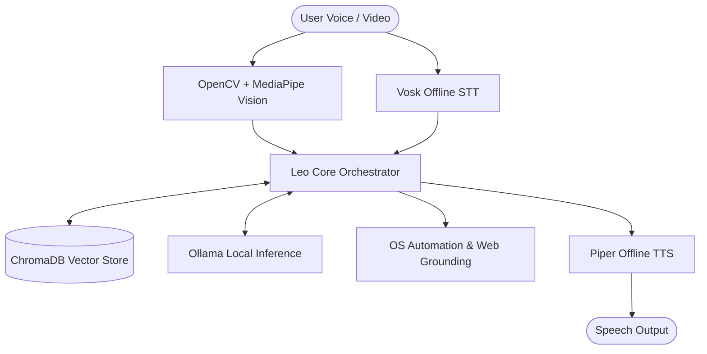

# 🤖 Frnd.AI (Leo) — Privacy-First Multilingual Desktop AI Assistant

[]()
[]()
[]()
[]()
[](LICENSE)

Frnd.AI (Leo) is a premium, local-first multilingual desktop assistant built for Windows. It integrates voice control (speech-to-text and text-to-speech), computer vision (facial emotion tracking), and deep operating system controls to create an interactive, offline-first experience—**requiring zero external API calls by default.**

---

## 🏗️ Neural & Voice Architecture

Leo coordinates voice feeds, visual telemetry, and local inference models inside a fast event loop:



### Technical Specs:
*   **Speech-to-Text (STT)**: Powered by Vosk's offline model for sub-50ms transcribing.
*   **Text-to-Speech (TTS)**: Piper engine executes highly natural voice synthesis.
*   **Computer Vision**: OpenCV + Mediapipe tracks facial features in real-time, adapting response tone based on webcam emotion metrics.
*   **Vector Memory**: Session memory is contextualized using ChromaDB vector database tables.

---

## ⚡ Key Features

*   **Multilingual Voice Control**: Native support for English, Hindi, and Telugu.
*   **Deep OS Automation**: Adjust brightness, volume, Night Light, process lists, take screenshots, and manage files via voice.
*   **Communication Bridge**: Compose and send emails and WhatsApp messages through offline speech processing.
*   **Local Web Grounding**: Live query verification using local scraping tools (DuckDuckGo & Wikipedia) to feed context back to Ollama.
*   **Infinity Core UI**: Reactive visual dashboard built in Python (Pygame/custom widgets) with dynamic micro-animations.

---

## 🛠️ Local Installation & Setup

### Prerequisites
*   **OS**: Windows 10/11
*   **Python**: v3.10 or higher
*   **Ollama**: [Download Ollama](https://ollama.com/) and download your local LLM:
    ```bash
    ollama pull llama3
    ```

### Installation Steps

1.  **Clone the Repository**:
    ```powershell
    git clone https://github.com/kalyan-1845/frnd.ai.git
    cd frnd.ai
    ```
2.  **Set Up Virtual Environment**:
    ```powershell
    python -m venv .venv
    .\.venv\Scripts\activate
    ```
3.  **Install Dependencies**:
    ```powershell
    pip install -r requirements.txt
    pip install chromadb opencv-python mediapipe pygame
    ```
4.  **Bootstrap Local Speech & Language Models**:
    Run the bootstrap utility to download off-line language packs:
    ```powershell
    python scripts\bootstrap_local_models.py --languages en hi te --clean-archives
    ```

---

## 🏃 Quick Start

*   **One-Click Boot**: Double-click `run_agent.bat` from your desktop.
*   **Terminal Boot**:
    ```powershell
    python main.py
    ```

---

## 🎤 Command Interface Examples

| Target | Voice Input Example | Actions Executed |
| :--- | :--- | :--- |
| **System** | `"Hey Leo, set brightness to 60%"` | Adjusts monitor display brightness directly |
| **Messaging** | `"Hey Leo, send email to Ravi"` | Opens local draft with dictated text |
| **Automation** | `"Hey Leo, create folder 'Research'"` | Creates a new desktop directory |
| **Analytics** | `"Hey Leo, summarize recent logs"` | Reads and prints SQLite event database records |

---

## 🔒 Privacy & Security

All inputs, logs, and webcam analytics remain strictly local:
*   **Zero Telemetry**: No tracking identifiers or usage statistics are uploaded.
*   **Private Memory**: Conversation details are stored in a local SQLite file (`nova_memory.db`).
*   **Vision Isolation**: Webcam frames are analyzed in-memory and discarded instantly; no media is saved.